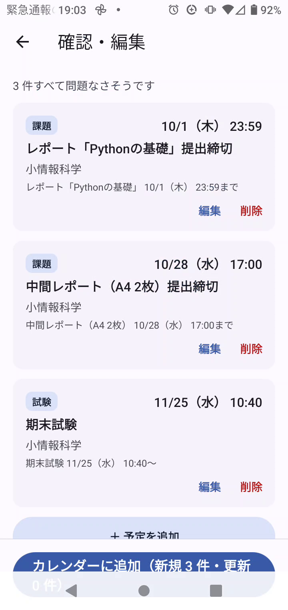
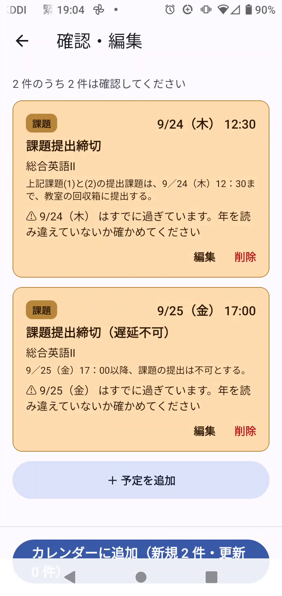
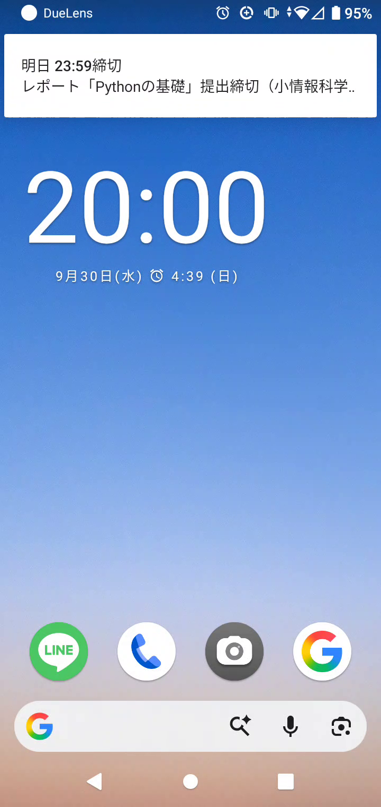
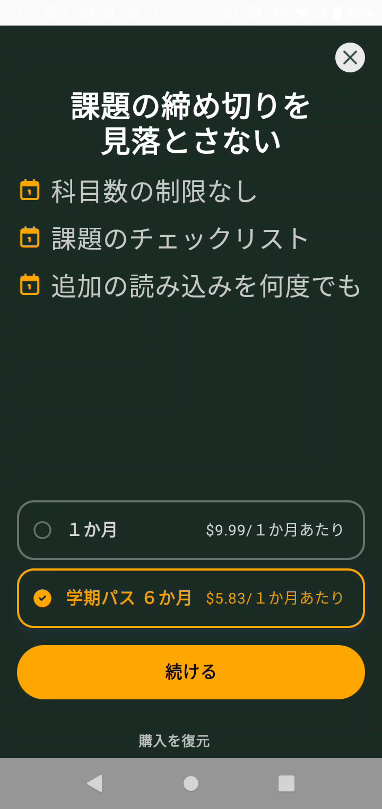
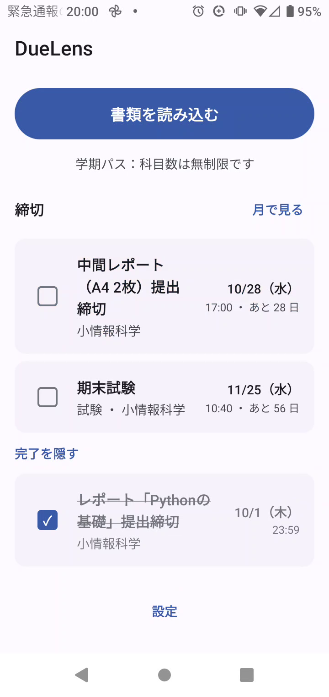

# DueLens

[日本語](./README.ja.md)

**Snap a handout, never miss a deadline.** DueLens is an Android app for students.
Take a photo, screenshot, or PDF of an assignment sheet or syllabus, and DueLens pulls out
the assignment deadlines and exam dates, adds them to your calendar, and reminds you before they're due.

Built for **RevenueCat Shipaton 2026 — Next Gen Award**.

- Demo video: _(YouTube link)_
- Full design spec (Japanese): [syllabus-calendar-spec.md](./syllabus-calendar-spec.md)

| Review what AI found | Warnings with reasons | Reminder | Paywall | Checklist |
| --- | --- | --- | --- | --- |
|  |  |  |  |  |

## The problem

At a Japanese university or college, every course hands out deadlines in its own way —
paper handouts, PDFs posted to Teams, a line in the syllabus. Copying them into a calendar
by hand is tedious, so many students just don't, and a single missed deadline can mean
the assignment isn't accepted at all.

## What DueLens does

1. **Snap the sheet** — camera, photo/screenshot, or PDF. Handwritten notes work too.
2. **AI finds every deadline** — assignments and exams are extracted as structured data.
3. **Check and fix** — a review screen shows each item with the original text it came from.
   Anything suspicious is flagged with a reason. Tap to edit, delete, or add an item.
4. **Added to your calendar** — written to a dedicated "シラバス" calendar, so it can be hidden or
   removed in one go. Editing an item later moves its calendar event, checklist entry, and reminders.
5. **Reminded before it's due** — local notifications at 20:00 the day before and 8:00 on the day.
6. **Check it off** — a deadline checklist (Pro). Completing an item cancels its reminders.
   A month view shows all deadlines at a glance.

## What makes it different

General "photo → calendar" apps exist. DueLens focuses on what's specific to school handouts:

- **"Lecture 8" becomes a real date.** Handouts often say "due at lecture 8" or "at the first class
  of the fall term" instead of a date. DueLens converts session numbers into dates deterministically in
  app code, taking into account make-up days, cancelled classes, national holidays, and holidays on
  which classes are held (priority: make-up > cancelled > holiday > normal). The AI never guesses the date.
  (This needs the course's weekday; if the sheet doesn't say, the user enters the date by hand.)
- **AI mistakes are caught by code, not by the AI's own confidence score.** The model returns both the
  date as written (`date_raw`, e.g. "9/25 (Fri)") and the normalized date. The app cross-checks them,
  so a mismatched weekday, a date already in the past, or a date over a year away is shown with a reason.
- **Priced by the semester, not by the scan.** Student life runs on semesters, so the free tier and
  the main plan are counted per course and per semester (see below).

## RevenueCat integration

| Plan | Price (Test Store) | What you get |
| --- | --- | --- |
| Free | $0 | Up to **3 courses per semester** |
| Monthly | $9.99 / month | Unlimited courses, deadline checklist, re-reading documents |
| **Semester Pass** | 6 months ($5.83 / month) | Same as monthly; the main plan, matched to a semester |

- **One entitlement, `pro`.** Offering `default` with two packages (monthly and 6-month).
- **RevenueCat Paywalls** renders the paywall. It appears at two moments where the user
  has just felt the value: when tapping the **checklist** checkbox (after purchase the tap goes through),
  and when reading a **4th course** in a semester.
- **Why count courses, not scans?** A student re-reads a sheet when it's blurry or when the
  teacher updates it. Charging per scan would punish that. Counting distinct courses per semester
  matches how students think ("this term I have 8 courses"). The count lives on the server
  (Cloudflare KV, per device and semester), so clearing app data doesn't reset it.
- **Resilient `pro` state.** If entitlement can't be checked (offline), the last known value is kept,
  so a paying user isn't downgraded just by launching without signal. `addCustomerInfoUpdateListener`
  picks up purchases and expirations; "Restore purchases" uses the same path.
- The app runs on the **RevenueCat Test Store** for judging. In production it would switch to a
  Google Play key.

## Architecture

```
app/      Expo (React Native / TypeScript) Android app — Expo Router, Zustand + AsyncStorage
shared/   The single source of truth shared by app, worker, and eval
          schema (AI output) / api (HTTP contract) / schedule (session → date) / review (warnings) / month
worker/   Relay API on Cloudflare Workers — calls the LLM, validates, enforces quota and rate limits
eval/     Accuracy evaluation set for extraction
```

- One zod schema in `shared/src/schema.ts` produces (1) the structured-output format sent to the LLM,
  (2) runtime validation, and (3) the TypeScript types.
- The worker validates the AI output in two layers: shape (zod), then meaning (e.g. a date as written
  but no normalized date). A meaning error triggers one retry with the errors fed back.
- The model is chosen by ID (`worker/wrangler.toml` → `MODEL`); `gemini-*` uses Google, anything else
  uses OpenAI. The default is `gpt-4.1-mini`, picked with the eval set below rather than by feel.
  OpenAI is the default because the developer is under 18, and the Gemini API terms require 18+
  with no parental-consent exception, while OpenAI allows 13+ with a parent's permission.

## Setup

Requirements: Node 20+, Android Studio, an Android 10+ phone, an OpenAI API key.
A Cloudflare account is **not** needed for local development.

```bash
npm install
npm test          # session→date conversion, warning rules, eval scoring
npm run typecheck
```

### Relay API (worker)

**Before creating the API key, set a usage limit and billing alert on OpenAI and turn off auto-recharge.**
OpenAI is prepaid, so with auto-recharge off, "the balance runs out and it stops" is the hard backstop.

```bash
cp worker/.dev.vars.example worker/.dev.vars    # put your API key here (never committed)
npm run worker:dev                              # http://localhost:8787, uses local KV
curl http://localhost:8787/health               # {"ok":true, ... "apiKey":{"present":true}, "kv":true}
```

Create `.dev.vars` before starting `worker:dev`; it isn't picked up while running.
Deploying (`wrangler kv namespace create QUOTA`, `wrangler secret put OPENAI_API_KEY`,
`npm run worker:deploy`) is optional and not needed for the award.

### App

Put your RevenueCat Test Store key in `app/app.json` → `extra.revenueCatAndroidKey`, then:

```bash
cd app
npx expo run:android --device          # development build (purchases don't work in Expo Go)
adb reverse tcp:8081 tcp:8081          # Metro over USB
adb reverse tcp:8787 tcp:8787          # the worker over USB
npx expo start --dev-client --port 8081
```

In development builds the app always calls `http://localhost:8787`, reaching the PC's worker over USB,
so a changing Wi-Fi address never requires a rebuild. Release builds use `extra.apiBaseUrl`.

### Extraction accuracy (eval)

```bash
npm run eval -- --dry-run                                  # no API key needed
npm run eval -- --model gpt-4.1-mini --long-edge 1024,1568,2048
```

The eval uses the worker's prompt, schema, validation, and retry as-is, so the chosen settings match
production. The test cases (real syllabi from my school) are not in the public repo because they
contain teachers' names. See [eval/README.md](./eval/README.md).

## Known trade-offs (stated openly)

**The relay API trusts the client.** `deviceId` and `pro` are sent by the app and not verified by the
server. Since the repo is public, here is what that allows and what limits it:

| Loophole | Effect | Status |
| --- | --- | --- |
| Send `pro: true` | Skips the free-tier check | Capped by `PRO_HARD_LIMIT` (200 courses per device and semester), and still logged |
| Change `deviceId` | Gets a fresh quota | Not addressed yet (Play Integrity is the real fix) |

Defenses, from most to least effective:

1. **Budget cap and alerts on the LLM provider** — the only absolute backstop; set before deploying
2. **Server-side purchase verification** via RevenueCat webhooks / REST API — for the distribution stage
3. **Device attestation** with Play Integrity — fixes `deviceId` spoofing, but heavy to implement
4. **Rate and size limits** — 6 requests/minute per IP, 5 pages, 12 MB

**Documents sent during development may be used by OpenAI.** The worker never stores images or PDFs.
However, during development, data sharing is enabled on the OpenAI side in exchange for free daily tokens,
which makes it affordable to run the eval many times. For that reason only my own syllabi are sent.
Before handling anyone else's documents, sharing will be turned off and the paid tier used.

Other choices:
- Multi-page documents are sent as one request (up to 5 pages) rather than split in parallel,
  which would require merging duplicate courses.
- If two documents name the same course, the user links them on the review screen.
- An undated item (e.g. "a quiz sometime in the term") is sometimes not extracted; the user can add it
  with "予定を追加" on the review screen.
- Reading the same sheet twice can create a duplicate if the AI words the title differently
  (the event key includes the title). Grouping by course + date + time is planned.

## What's next

- Import the academic calendar to set up the semester automatically
- On-device OCR, and highlighting where on the image each deadline was read
- iOS
- Beyond university: school handouts and event schedules for parents, certification exams,
  municipal garbage-collection calendars

## License

MIT — see [LICENSE](./LICENSE).
