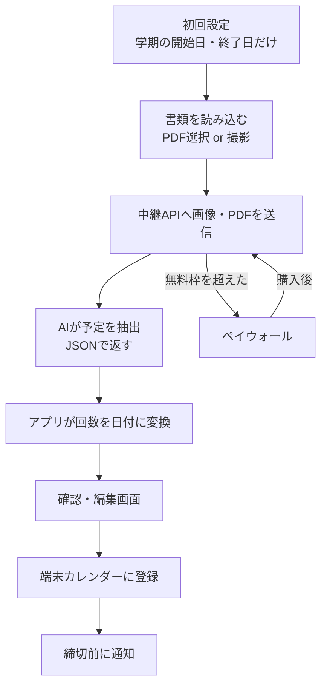
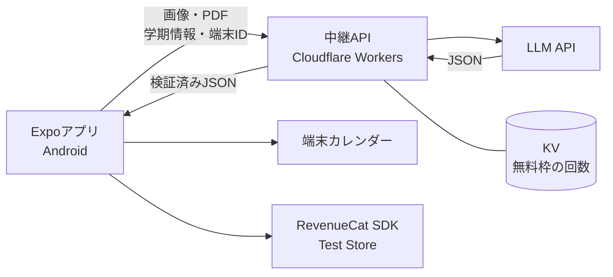

# シラバス→カレンダー変換アプリ 仕様書

2026-09-24（第5版）

### 第5版の主な変更点

- **主目的を「課題の締切を手軽に登録し、通知で見落とさない」に変更**（1章）。「シラバスをカレンダーに登録する」から架け替えた。9/22に方針だけ決まり、9/24に確定。`class`（授業日）は毎週固定なので時間割で足り、カレンダーに入れる価値が低い。主役は `assignment` と `exam` で、**通知（F7）が価値の決め手**になる。
- シラバスは入力の1つという位置づけに下げる。課題一覧・配布プリント・Teamsに上がったPDFのスクショなど、締切が書かれた書類なら何でも読む。
- **通知（F7）は必須のまま、実装は後回しにする。** 先に「読み込む→確認→登録」を固め、通知は最後に足す。
- 抽出の仕組み（4章）・課金（6章）は変えない。回数→日付変換（4.3）も「後期最初の授業でテスト」「第8回 中間試験」のような締切に効くので残す。

### 第4版の主な変更点

残っていた設計の穴をすべて埋めた。第3版はAI抽出スキーマのみの改訂で、以下は未解決だった。

- **回数→日付変換の判定順を確定**（4.3）。振替授業日＞休講日＞祝日＞通常。同じ日が振替授業日と休講日に重なった場合は振替が勝つ。
- **第1回の起点のずれに対応**（4.3）。ガイダンス回や履修登録期間で初回がずれるため、科目ごとに `firstSessionDate` で上書きできるようにした。
- **日付の実装ルールを明記**（4.3）。`YYYY-MM-DD` 文字列で扱い、`Date` と `toISOString()` を使わない。JSTで1日ずれるため。
- **祝日を保存しない方式に変更**（4.4）。祝日はライブラリから毎回導出し、保存するのはユーザーの意思決定（`classHolidays` / `noClassDates`）だけにした。
- **evalセットを導入**（4.7）。正解つきのテストセットを先に作り、モデル選定・画像サイズ決定・リグレッション検知に使う。9/20〜9/21に作成。
- **複数ページの送り方を確定**（4.1）。MVPは最大5ページを1リクエスト。
- **無料枠の既知の制約を明記**（6.3）。端末IDも購入状態も自己申告で偽装可能。実質の防衛線は予算上限とレート制限。
- **カレンダー登録の方針を追加**（7.6）。専用カレンダー「シラバス」を作る。重複検出（F11）を推奨から必須に格上げ。
- **ログの方針を追加**（7.5）。画像は保存しないが、モデル名・トークン数・所要時間・検証結果・出力JSONは記録する。
- **課金を確定**（6章）。無料枠は案B（1学期3科目まで）、学期パスは6か月の自動更新サブスク、価格は月額300円／学期800円。カウントの単位を「読み込み回数」から「科目」に変更した。

### 第3版の主な変更点

- AI抽出のJSONスキーマを再設計（4.2）。1つの書類に複数科目が載るケース（課題一覧など）に対応し、`courses[]` と `course_index` の形にした。
- LLMの自己申告 `confidence` を廃止し、`date_basis`（日付の根拠）と `date_raw`（書類にあった日付表記そのもの）に置き換えた（4.2）。`date_raw` と `date` を突き合わせることで、AIの誤りをアプリ側のコードで検出できる。
- 「要確認」の判定を、スコアの閾値ではなく、アプリ側で計算する理由つきのフラグ（`ReviewReason`）に変更（4.4・4.6）。
- 検証を「形（zod）」と「意味」の2層に分け、再試行時にエラー内容をLLMに返す修復リトライを採用（4.5）。
- 中継APIのLLM呼び出しに Vercel AI SDK の `generateObject` を使うことを決定（7.2）。zodスキーマ1本から、出力形式の指定・実行時検証・TypeScriptの型をすべて導出し、モデルの差し替えを1行で行えるようにする。

### 第2版の主な変更点

- 開発環境（Windows＋Android実機）に合わせ、**Expo（React Native）でAndroid版のみ**を作ることに決定。iOS版は今後の構想へ。
- AI抽出は、端末上のOCRをやめて**画像・PDFをそのままLLMに送る**方式に変更（開発期間の短縮のため）。
- 課金のテストは**RevenueCat Test Store**で行う（Google Play Consoleの登録は不要）。
- 回数→日付変換を、**振替授業日と授業を行う祝日**に対応する方式に変更。
- 無料枠のカウントを端末からサーバー側に移動。
- API費用の見積もりと、費用が膨らまないための対策を追加（7.3）。
- 公式ページで確認した応募要件を反映し、運営に確認する項目を追加。

## 1. 概要

**課題の締切を手軽に登録し、通知で見落とさないようにする**学生向けアプリ。課題の案内・シラバス・課題一覧のPDFや写真、スクショを読み込むと、課題の締切と試験日を取り出してカレンダーに登録し、締切の前に通知する。RevenueCat Shipaton 2026の Next Gen Award（学生部門）に応募する。

主役は課題（`assignment`）と試験（`exam`）で、授業日（`class`）は脇役。授業は毎週同じなので時間割で足りるが、締切は科目ごとにばらばらに配られ、1つ見落とすと減点や提出不可になる（実例：「9/25 17:00以降、課題の提出は不可とする」）。

| 項目 | 内容 |
| --- | --- |
| アプリ名（仮） | 未定 |
| 対象ユーザー | 日本の大学生・専門学校生 |
| 解決する課題 | 科目ごとに紙・PDF・Teamsなどばらばらに配られる課題の締切を見落とすこと。手で写す手間が面倒で、登録そのものをしなくなる |
| 提供価値 | 撮る（スクショする）だけで締切が登録され、締切の前に通知が来る |
| 対応端末 | Android 10以降（応募時）。iOSは今後の構想 |
| 開発環境 | Windows＋Android実機、Expo（React Native / TypeScript） |
| 応募部門 | Next Gen Award（デモ動画＋公開リポジトリで応募、ストア公開・有料の開発者アカウントは不要） |
| 提出締切 | 2026年9月30日 23:45（米国太平洋時間） |

審査基準は、アイデアの明確さ、動作の進捗（動画とリポジトリで示す）、RevenueCat連携の工夫、技術・プロダクトの完成度。

### Next Gen Awardの応募条件（公式ページで確認済み）

- Devpostで学生用・学校のメールアドレス（.ac.jp など）を使って応募する。
- デモ動画（2分以内、YouTubeまたはVimeoで公開、実機で動く様子を見せる）。
- 公開リポジトリ（コード、セットアップ手順、オープンソースライセンスを含める）。
- アプリの説明文。

アプリは配布しないので、ストアの審査や本番の課金設定は不要。ただし動画が「本当に動く」証拠、リポジトリが「本当に作った」証拠になるため、READMEの分かりやすさも実質的な評価対象になる。

## 2. ユーザーフロー

初回に学期の開始日・終了日だけを設定し、その後は「読み込み→確認→登録」の3ステップで使う。

**休講日・振替授業日は初回に聞かない。** 「手で写す手間を省くアプリ」が、使い始める前に
学年暦を手で写させるのは筋が通らない。ここが最初の離脱点になる。

空でも破綻しないのは、`effectiveWeekday`（4.3）が祝日を `holidays.ts` から自動判定するため。
手入力が要るのは大学独自の休講日・振替日だけで、ずれても確認画面で `firstSessionDate` を
1箇所直せば以降の全回がまとまって直る。機能そのものは残し、**設定画面（S7）から後で足せる**
位置に移す。本来の埋め方は F12（学年暦を撮って取り込む）で、手入力はその代替にすぎない。



確認・編集画面を必ず挟み、AIの誤読をユーザーが直してから登録する。

## 3. 機能要件

MVPは下表の「必須」だけで審査に出せる状態にする。「推奨」は時間が余れば入れ、「将来」はREADMEの今後の構想に書く。

| ID | 機能 | 内容 | 優先度 | 課金 |
| --- | --- | --- | --- | --- |
| F1 | 学期設定 | 開始日・終了日、休講日、振替授業日（「この日は月曜の授業」）を登録。祝日は自動反映し、授業を行う祝日は外せる。複数学期を保存 | 必須 | 無料 |
| F2 | 書類の読み込み | PDF選択、カメラ撮影、写真ライブラリから選択。複数ページ対応 | 必須 | 無料 |
| F3 | AI予定抽出 | 画像・PDFを中継API経由でLLMに送り、科目名・予定名・種別・日付・時刻を構造化して返す | 必須 | 無料枠あり（6章） |
| F4 | 回数→日付変換 | 「第5回」などを学期設定と曜日から実際の日付に変換（4.3） | 必須 | 無料 |
| F5 | 確認・編集 | 抽出結果の一覧表示、修正・削除・追加、要確認の項目を理由つきで強調（4.6） | 必須 | 無料 |
| F6 | カレンダー登録 | 端末カレンダーに専用カレンダー「シラバス」を作って一括登録（7.6）。書き込み先は設定で変更可 | 必須 | 無料 |
| F7 | 通知 | 課題・試験の締切の前日・当日に通知。タイミングは設定で変更。**主目的の決め手だが、実装は「読み込む→確認→登録」が固まった後に回す**（第5版） | 必須 | 無料 |
| F8 | ペイウォール | RevenueCat Paywallsで表示・購入・復元（Test Store） | 必須 | ー |
| F9 | 課題チェックリスト | 締切一覧に完了チェックと残り日数を表示 | 推奨 | 有料 |
| F10 | ウィジェット | 直近の締切をホーム画面に表示 | 推奨 | 有料 |
| F11 | 重複検出 | 同じ予定を二重登録しない。登録済みイベントIDを保存し、再読み込み時は更新かスキップ（7.6） | 必須 | 無料 |
| F12 | 学年暦の読み込み | 大学の学年暦を撮影し、休講日・振替授業日を自動で学期設定に入れる | 将来 | 未定 |
| F13 | 端末上のOCR | 画像をサーバーに送らず端末で文字を抽出し、テキストだけ送る（プライバシー強化） | 将来 | ー |
| F14 | iOS版 | EAS Buildでビルド | 将来 | ー |
| F15 | 共有 | 抽出結果を友人に共有（同じ授業の学生向け） | 将来 | 未定 |
| F16 | 他用途モード | 学校プリント（保護者向け）、資格試験、ゴミ収集表など | 将来 | 未定 |

## 4. AI抽出仕様

画像・PDFと学期設定をLLMに渡し、JSONだけを返させる。

設計の基本方針は、**LLMには「書類に何が書いてあるか」の読み取りだけをさせ、計算・判断・検証はアプリと中継APIのコード側で行う**こと。日付の計算（4.3）、要確認かどうかの判定（4.6）、出力の妥当性チェック（4.5）は、いずれもコードで決定的に行い、あとから指差し確認できるようにする。

### 4.1 入力

- 画像（JPEG、長辺を縮小して送る）またはPDF。複数ページ可
- 学期の開始日・終了日
- 今日の日付（年が書かれていない日付の補完に使う）

**複数ページの送り方**：MVPでは**最大5ページを1リクエストにまとめて送る**。1ページ目に科目名、2ページ目に日程、という書類が多く、ページをまたいだ文脈が必要なため。6ページ以上は受け付けず、選び直してもらう。

分割して並列実行し結果をマージする方式（速く、失敗が1ページに局所化する）は、`courses[]` の重複解決が必要になるため今回は採らない。READMEの「今後の改善」に書く。

**画像の縮小サイズ**は、費用（トークン数は解像度にほぼ比例する）と精度（縮小しすぎると小さい文字が読めない）のトレードオフになる。勘で決めず、4.7のevalで実測して決める。

### 4.2 出力（JSON）

1つの書類に複数科目が載る場合（課題一覧、時間割など）があるため、トップレベルを `courses[]` の配列にし、各予定は `course_index` で科目を参照する。1科目だけの書類でも配列長1になるだけで、追加のコストはない。

```json
{
  "courses": [
    {
      "name": "線形代数学I",
      "weekday": "MON",
      "period": 2,
      "start_time": "10:40",
      "end_time": "12:10",
      "room": "A棟201"
    }
  ],
  "events": [
    {
      "course_index": 0,
      "title": "レポート1提出",
      "type": "assignment",
      "date_raw": "10/20（火）",
      "date": "2026-10-20",
      "date_basis": "explicit",
      "session_number": null,
      "time": "23:59",
      "source_text": "10/20（火）23:59までにLMSへ提出",
      "page": 1
    },
    {
      "course_index": 0,
      "title": "中間試験",
      "type": "exam",
      "date_raw": null,
      "date": null,
      "date_basis": "session_only",
      "session_number": 8,
      "time": null,
      "source_text": "第8回 中間試験",
      "page": 2
    }
  ]
}
```

| フィールド | 内容 |
| --- | --- |
| `course_index` | `courses[]` の添字。どの科目の予定かを示す |
| `type` | `class` / `assignment` / `exam` / `other` のいずれか |
| `date_raw` | 書類に書かれていた日付表記をそのまま写した文字列。書かれていなければ `null` |
| `date` | `date_raw` を正規化した `YYYY-MM-DD`。確定できなければ `null` |
| `date_basis` | `explicit`（日付が明記）／`inferred`（他の記述から推測）／`session_only`（回数のみ） |
| `session_number` | 「第n回」の n。4.3でアプリが実際の日付に変換する |
| `time` | 時刻（`HH:MM`）。書かれていなければ `null` |
| `source_text` | 確認画面で元の記述を見せるために使う |
| `page` | 何ページ目の記述か。複数ページ読み込み時に出所を示す |

`date` と `session_number` は、どちらか一方が必ず入る（検証は4.5）。

#### `date_raw` を出させる理由

`date_raw` は `date` と重複した情報だが、あえて両方を出させる。両者を突き合わせることで、**LLMの誤りをアプリ側のコードで検出できる**ため。

```ts
// 曜日クロスチェック：date_raw に曜日が書かれていれば、date と一致するか検算する
const m = e.date_raw?.match(/[（(]([月火水木金土日])[）)]/);
if (m && e.date && weekdayOf(e.date) !== KANJI_TO_WEEKDAY[m[1]]) {
  // 年の取り違えや日付の捏造。理由つきで確認画面に強調表示する（4.6）
}
```

第2版の `confidence`（LLMの自己申告スコア）は廃止した。自己申告の確信度は較正されておらず、自信を持って間違えることがあるため、0.7という閾値が機能しない。代わりに `date_basis` のような**観測可能な事実**を出させ、要確認の判定はアプリ側で行う（4.6）。

> プロンプトには「`date_raw` は書類の文字列をそのまま写すこと。書かれていない場合は `null` とし、**推測した日付を `date_raw` に書いてはならない**」と明記する。これを書かないとLLMが自分の推測を `date_raw` に逆流させ、検算が常に成功してしまい、チェックが無意味になる。

#### スキーマ定義（zod）

zodスキーマを1本だけ書き、①LLMへの出力形式の指定、②実行時の検証、③アプリ側のTypeScript型、の3つをすべてここから導出する（7.2）。

```ts
// worker/src/schema.ts（アプリと中継APIで共有する唯一の定義）
import { z } from "zod";

const Weekday = z.enum(["MON","TUE","WED","THU","FRI","SAT","SUN"]);
const HHMM    = z.string().regex(/^([01]\d|2[0-3]):[0-5]\d$/);
const ISODate = z.string().regex(/^\d{4}-\d{2}-\d{2}$/);

const Course = z.object({
  name:       z.string(),
  weekday:    Weekday.nullable(),
  period:     z.number().int().min(1).max(8).nullable(),
  start_time: HHMM.nullable(),
  end_time:   HHMM.nullable(),
  room:       z.string().nullable(),
});

const Event = z.object({
  course_index:   z.number().int().min(0),
  title:          z.string(),
  type:           z.enum(["class","assignment","exam","other"]),
  date_raw:       z.string().nullable(),
  date:           ISODate.nullable(),
  date_basis:     z.enum(["explicit","inferred","session_only"]),
  session_number: z.number().int().min(1).max(40).nullable(),
  time:           HHMM.nullable(),
  source_text:    z.string(),
  page:           z.number().int().min(1),
});

export const Extraction = z.object({
  courses: z.array(Course).min(1),
  events:  z.array(Event),
});
export type Extraction = z.infer<typeof Extraction>;
```

構造化出力向けにスキーマを書くときの方針：

- **`optional` ではなく `nullable` を使う**。「キーを省く」より「キーは必ず出し、不明なら `null`」のほうが、LLMは安定して守れる。
- **ユニオン型と深いネストを避け、フラットに保つ**。判別可能ユニオンは各社の構造化出力機能でのサポートが弱い。
- `session_number` の上限40は、通年科目（30回程度）と集中講義を含めた余裕を見た値。

### 4.3 回数→日付変換ルール（アプリ側）

学期中の「その曜日の授業日リスト」を作り、第n回はそのn番目とする。

#### 判定の優先順位

ある日に授業があるか、あるとすれば何曜日の授業か（＝**授業曜日**）は、次の順に判定する。上が優先。**明示的な指定が、自動判定を上書きする**という一貫したルールになっている。

| 順 | 条件 | 授業曜日 |
| --- | --- | --- |
| 1 | 振替授業日に指定されている | 授業あり。**振替先の曜日**（`asWeekday`） |
| 2 | 休講日に指定されている | 授業なし |
| 3 | 祝日である（`classHolidays` に無い） | 授業なし |
| 4 | 祝日だが `classHolidays` にある | 授業あり。実際の曜日 |
| 5 | 上記以外 | 授業あり。実際の曜日 |

同じ日が振替授業日と休講日の両方に入っていた場合は、**振替授業日が勝つ**（大学が「この日に授業をする」と決めた日なので）。

```ts
function effectiveWeekday(sem: Semester, d: string): Weekday | null {
  const m = sem.makeupDays.find(x => x.date === d);
  if (m) return m.asWeekday;                                  // 1
  if (sem.noClassDates.includes(d)) return null;              // 2
  if (isHoliday(d) && !sem.classHolidays.includes(d)) return null; // 3, 4
  return weekdayOf(d);                                        // 5
}
```

#### 第n回の決め方

1. 学期開始日から終了日まで1日ずつ見て、`effectiveWeekday` が科目の曜日と一致する日を順に並べる（＝授業日リスト）。
2. 第n回はリストのn番目。
3. nがリストの長さを超えた場合は変換せず、`session_unresolved` として確認画面に出す。
4. 科目の曜日が不明（`weekday` が `null`）な場合は変換せず、`weekday_unknown` として確認画面で曜日を選んでもらう。

#### 起点のずれへの対処

ガイダンス回を第1回に数えるか、履修登録期間で初回が後ろにずれるかは大学・科目によって異なるため、**科目ごとに「第1回の日付」を上書きできる**ようにする（`Course.firstSessionDate`）。

- 未設定なら、授業日リストの先頭を第1回とする。
- 設定されていれば、その日をリスト内で探し、そこを第1回として数える。

```ts
const list = classDates(sem, course.weekday);
const base = course.firstSessionDate ? list.indexOf(course.firstSessionDate) : 0;
const i = base + (n - 1);
const date = (base >= 0 && i < list.length) ? list[i] : null;  // null なら session_unresolved
```

確認画面で「第8回 → 11/17（月）」と変換結果を出し、ずれていればユーザーが第1回を直せるようにする。1箇所直せば以降の全回がまとめて直るので、修正コストが低い。

#### 日付の扱い（実装ルール）

**カレンダー上の日付は `YYYY-MM-DD` の文字列として扱い、JavaScriptの `Date` を経由させない。** JSTでは次のズレが起きるため。

```js
new Date(2026, 9, 20).toISOString().slice(0, 10)  // => "2026-10-19" ← 1日ずれる
```

ローカルタイムで作った日付をUTCで文字列化すると、JST（UTC+9）では前日に飛ぶ。締切アプリでは致命的になる。

- `schedule.ts` の内部は、文字列と「年・月・日」の数値だけで完結させる。
- `toISOString()` は使わない。
- 端末カレンダーへの登録時（`expo-calendar`）にだけ、日付＋時刻を実際の日時に変換する。

#### テスト

この処理は画面から切り離した関数（`lib/schedule.ts`）として書き、単体テストを付ける。最低限、次をテストケースに含める。

- 振替授業日（日曜に月曜の授業）
- 授業を行う祝日（`classHolidays`）
- 振替授業日と休講日が同じ日に重なった場合（振替が勝つ）
- 学期終了を超えた第n回（`session_unresolved`）
- `firstSessionDate` を設定した場合／設定した日がリストに無い場合
- 月末・年またぎ（12/29、1/1）と、`toISOString` のズレが出る日

### 4.4 データの型

```ts
type Weekday = "MON" | "TUE" | "WED" | "THU" | "FRI" | "SAT" | "SUN";

type Semester = {
  id: string;
  name: string;              // "2026年度 後期"
  start: string;             // "2026-09-28"
  end: string;               // "2027-01-29"
  noClassDates: string[];    // 大学が指定した休業日（祝日は含めない）
  classHolidays: string[];   // 祝日だが授業を行う日
  makeupDays: { date: string; asWeekday: Weekday }[]; // 振替授業日
};

type Course = {
  id: string;
  semesterId: string;
  name: string;
  weekday: Weekday | null;   // 不明なら null（集中講義など）
  period: number | null;
  startTime: string | null;
  endTime: string | null;
  room: string | null;
  firstSessionDate: string | null; // 第1回の日付。未設定なら授業日リストの先頭（4.3）
};

// 確認画面で「なぜ要確認なのか」を示すための理由。アプリ側で計算する（4.6）
type ReviewReason =
  | { kind: "weekday_mismatch"; message: string }  // date_raw の曜日と date が不一致
  | { kind: "out_of_semester"; message: string }   // 学期の範囲外の日付
  | { kind: "date_inferred" }                      // 日付が明記されておらず推測された
  | { kind: "session_unresolved" }                 // 第n回が学期を超えた（4.3）
  | { kind: "weekday_unknown" }                    // 科目の曜日が不明（4.3）
  | { kind: "quote_mismatch" }                     // date_raw が source_text に含まれない
  | { kind: "time_assumed" };                      // 締切時刻がなく23:59を仮置きした

type DraftEvent = {
  id: string;
  course: string;
  title: string;
  type: "class" | "assignment" | "exam" | "other";
  date: string | null;       // 確定しない場合はnull
  sessionNumber: number | null;
  time: string | null;
  sourceText: string;
  dateRaw: string | null;
  dateBasis: "explicit" | "inferred" | "session_only";
  page: number;
  reviewReasons: ReviewReason[];   // 空なら確認不要
};
```

**祝日そのものは保存しない。** 祝日は毎回ライブラリ（`holiday_jp` など）から導出し、保存するのは**ユーザーの意思決定**（「この祝日は授業がある」＝`classHolidays`、「この日は休講」＝`noClassDates`）だけにする。第2版では祝日を `noClassDates` に展開して保存する想定だったが、その方式だと学期の日付を後から変えたときに祝日リストが古いまま残り、同期を取り続ける義務が発生する。導出できるものは保存しない。

### 4.5 検証とエラー時の扱い

検証を「形」と「意味」の2層に分ける。スキーマは形しか縛れず、「`date` と `session_number` のどちらか一方」のような制約は構造化出力の機能では表現できないため、意味の検証を別に置く。

```
LLMの出力
  ↓
[層1] zodで検証   … 形の検証。JSONの破損、型違い、enum違反
  ↓
[層2] 意味の検証  … スキーマでは表現できない制約
  ↓
  ├─ hard error → エラー内容を添えて1回だけ再試行（修復リトライ）
  └─ soft flag  → 要確認として確認画面（S5）で強調
```

| 検出する内容 | 層 | 扱い |
| --- | --- | --- |
| JSONとして読めない、型違い、enum違反 | 1 | hard：再試行 |
| `date` と `session_number` が両方 `null` | 2 | hard：再試行 |
| `course_index` が `courses[]` の範囲外 | 2 | hard：再試行 |
| `date_raw` の曜日と `date` の曜日が不一致 | 2 | soft：要確認 |
| `date` が学期の範囲外 | 2 | soft：要確認 |
| `date_basis` が `explicit` でない | 2 | soft：要確認 |
| `date_raw` が `source_text` に含まれない | 2 | soft：要確認 |
| `type` が `assignment` なのに `time` が `null` | 2 | soft：23:59を仮置きして要確認 |

再試行は、同じ要求を投げ直すのではなく、**何が問題だったかを文章で渡してやり直させる**（修復リトライ）。素の再試行では同じ失敗を繰り返すため。

```
前回の出力に問題がありました：
- events[3]: date と session_number が両方 null です。必ずどちらかを埋めてください。
- events[7]: course_index が 2 ですが、courses は 2 件（0〜1）です。
上記を修正して、JSON全体を出力し直してください。
```

- 再試行しても失敗した場合は、手入力画面を出す。
- 予定が0件の場合は「日程が見つかりませんでした」と表示し、撮り直しを促す。

### 4.6 「要確認」の判定

要確認かどうかはLLMのスコアではなく**アプリ側のコード**で判定し、`ReviewReason`（4.4）として**理由を添えて**確認画面に渡す。

確認画面では「⚠ 要確認」ではなく、「⚠ 10/20（火）とありますが、2026-10-20は日曜です」のように具体的な理由を表示する。ユーザーが何を直せばよいか分かり、修正のコストが下がるため。

判定は `app/lib/review.ts` に切り出し、単体テストを付ける。

### 4.7 抽出精度の評価（eval）

抽出の良し悪しを「なんとなく良くなった気がする」で判断しないために、**正解つきのテストセットを先に作る**。これがないと、9章の「使用するLLM」も4.1の「画像の縮小サイズ」も決められない。

```
eval/
├─ cases/
│  ├─ 001.jpg
│  ├─ 001.expected.json   … 手で書いた正解
│  ├─ 002.pdf
│  ├─ 002.expected.json
│  └─ …（5〜10件）
└─ run.ts                 … 全件流してフィールド単位の一致率を出す
```

- **件数は5〜10件**で十分。自分の大学のシラバスと課題一覧を使う。
- 指標は凝らない。`courses[].name` / `events[].date` / `events[].session_number` / `events[].type` の**フィールド単位の一致率**と、イベントの取りこぼし・余計な追加の件数を出すだけでよい。
- **意図的に難しいケースを入れる**：年が書かれていない日付、複数科目が1枚に載った課題一覧、「第8回」しか書かれていない試験、手書きの書き込みがあるもの。
- 「年が書かれていない」ケースは、4.2の**曜日クロスチェックが実際に誤りを検出できるか**の確認にも使う。

用途は3つ：

1. **モデルの選定** — `run.ts` のモデル指定を配列にして回せば、Gemini Flash-Lite / Flash / 他モデルの精度・速度・費用を数分で比較できる（7.2）。
2. **画像縮小サイズの決定** — 長辺1024／1568／2048で回し、精度が落ちない最小サイズを採用する。
3. **リグレッション検知** — プロンプトやスキーマを変えたとき、直したつもりが別のケースを壊していないかが分かる。

作成は9/20〜9/21（写真→JSONが通った直後）。半日で作れて、以降の判断がすべて速くなる。

## 5. 画面構成

MVPは7画面。ホームの「読み込む」ボタンから確認画面までを、最短の操作でたどれるようにする。

| No | 画面 | 主な要素 |
| --- | --- | --- |
| S1 | オンボーディング | アプリの価値を3枚で説明、カレンダー・通知の権限リクエスト |
| S2 | 学期設定 | 開始日・終了日のみ（カレンダーピッカー）。祝日は自動反映。休講日・振替授業日はここでは聞かない |
| S3 | ホーム | 「読み込む」ボタン、直近の締切一覧、残りの無料科目数（「残り3科目」） |
| S4 | 読み込み中 | 進捗表示（書類を送信中→予定を整理中） |
| S5 | 確認・編集 | 予定のカード一覧、元の記述の表示、理由つきの要確認表示（4.6）、登録ボタン |
| S6 | ペイウォール | RevenueCat Paywallsで表示。無料と有料の比較、学期パスと月額の選択、購入の復元 |
| S7 | 設定 | 登録先カレンダー、通知タイミング、学期の切り替え、サブスク管理、休講日・振替授業日の追加（任意） |

確認画面（S5）はデモ動画の見せ場なので、登録件数と「カレンダーに追加」ボタンを大きく配置する。

## 6. 課金設計（RevenueCat）

| プラン | 価格 | 種類 | 内容 |
| --- | --- | --- | --- |
| 無料 | 0円 | ー | **1学期あたり3科目まで**読み込み、カレンダー登録、通知 |
| 月額 | 300円/月 | 自動更新サブスク | 科目数無制限、課題チェックリスト、ウィジェット |
| 学期パス | 800円/半年 | **6か月の自動更新サブスク** | 月額と同じ内容。学期単位で割安（月額換算133円） |

学期パスを自動更新サブスクにしたのは、RevenueCatのEntitlement／Offeringが素直に組め、審査でサブスク設計として説明できるため。ユーザーから見れば、解約すれば実質買い切りと同じになる。

### 6.1 RevenueCatの設定

- ストア：**Test Store**（Test APIキーを使用。React Native SDK 9.5.4以上）。Google Play Consoleの登録は不要
- Entitlement：`pro`（有料機能はすべてこれで判定）
- Offering：`default`（月額と学期パスの2パッケージ）
- Paywall：RevenueCat Paywalls（react-native-purchases-ui）で作成し、アプリを更新せずに文言を差し替えられるようにする
- 表示タイミング：無料の3科目を使い切って4科目目を読み込もうとしたとき、有料機能をタップしたとき、設定画面から
- 購入の復元ボタンをペイウォールと設定画面に置く
- READMEに「審査用にTest Storeで動かしている」「本番ではGoogle Playのキーに切り替える」と明記する

### 6.2 無料枠の設計

**1学期あたり3科目まで無料**とする（第2版の案Bを採用）。

学生は学期の初めに10〜15科目を一気に読み込み、その後はほとんど読み込まない。このため「月◯回」の枠（案A）だと、読み込みが終わった後に月額を払い続ける理由が弱く、解約されて終わる。**課金の単位を学期に合わせる**ことで、学生の生活のリズムと一致させる。

無料で試せるのは3科目まで。残りの科目の読み込みと、学期を通して使う機能（課題チェックリスト、ウィジェット、通知の細かい設定）を学期パスで提供する。

### 6.3 無料枠のカウント

カウントの単位は**科目**（`courses[]` の件数）。読み込み回数ではない。

- 中継API側で、**端末ID＋学期ID** をキーに、その学期で抽出済みの**科目名のセット**をCloudflare KVに保存する（再インストールでリセットされないように）。
- **抽出前**：登録済み科目が3件以上で `pro` を持たない場合、抽出せずにペイウォールを返す（LLMを呼ばないので費用が発生しない）。
- **抽出後**：返ってきた `courses[]` のうち、そのセットにまだ無い科目名を加算する。
- **同じ科目の別書類は枠を消費しない**。シラバスと課題一覧を別々に読み込んでも1科目として数える。
- 1回のリクエストに枠を超える科目数が入っていた場合、その回は通す（ユーザーに有利な側に倒す）。科目単位で厳密に打ち切る方式は今後の改善点。
- アプリはRevenueCatの購入状態（`pro`の有無）を一緒に送る。

ホーム画面（S3）には「残り3科目」のように科目数で表示する。

#### 既知の制約（READMEにも明記する）

リポジトリが公開なので、APIの呼び出し方も「`pro: true` を送れば無制限になる」ことも読める。**端末IDも購入状態もクライアントの自己申告であり、偽装できる。**

クライアントから来る値はすべてユーザーが書いた値なので、これをアクセス制御の根拠にはできない。**実質的な防衛線はサーバー側の絶対上限**に置く。

| 対策 | 内容 |
| --- | --- |
| LLM側の予算上限・使用量アラート | 最終防衛線（7.4）。月1,000円などの上限を必ず設定する |
| Cloudflare側のレート制限 | IP単位で1分あたりの呼び出し回数を制限する |
| リクエストサイズの上限 | 画像5ページまで、合計バイト数の上限を中継APIで弾く |

購入状態のサーバー側での検証（RevenueCatのWebhookやREST APIで照合する）は、実際のユーザーに配布する段階で入れる。今後の改善点としてREADMEに書く。

分かっていて割り切った制約であることを示せるため、READMEに書くことは審査でむしろプラスに働く。

### 6.4 審査での見せ方

- 学生の生活は学期単位なので、学期パスが自然な選択肢であることを説明する。
- 学期の初め（シラバスが配られる時期）に需要が集中する点を、課金のタイミング設計として示す。
- 1学期あたりのAPI原価（7.3）と価格を並べ、原価に見合った価格であることを示す。
- Test Storeで購入・復元が動く様子を動画に入れる。

## 7. 技術構成と非機能要件

### 7.1 構成

AI抽出だけを小さなサーバー（中継API）経由で呼び出し、APIキーをアプリに含めない。



リポジトリは1つにして、アプリと中継APIを同じ場所に置く。

```
syllabus-calendar/
├─ app/            … Expoアプリ（TypeScript）
│  ├─ app/         … 画面（Expo Router）
│  ├─ lib/
│  │  ├─ schedule.ts   … 回数→日付変換（テスト付き）
│  │  ├─ review.ts     … 要確認の判定（4.6、テスト付き）
│  │  ├─ extract.ts    … 中継APIの呼び出し
│  │  ├─ calendar.ts   … 端末カレンダー登録
│  │  └─ purchases.ts  … RevenueCat
│  └─ store/       … 状態管理と保存
├─ worker/         … 中継API（Cloudflare Workers）
│  └─ src/
│     ├─ schema.ts     … AI出力のzodスキーマ（4.2）。アプリ側もこの型を使う
│     ├─ validate.ts   … 意味の検証と修復リトライ（4.5）
│     └─ index.ts      … エンドポイント、無料枠のカウント、レート制限
├─ eval/           … 抽出精度の評価セット（4.7）
│  ├─ cases/       … シラバス画像と手書きの正解JSON
│  └─ run.ts
├─ .env.example
└─ README.md
```

`schema.ts` は**アプリと中継APIの両方から参照する唯一の型定義**にする。ここを直せば、LLMへの出力指定・実行時検証・アプリ側の型が同時に揃う。

### 7.2 使用するライブラリ

| 領域 | 使うもの |
| --- | --- |
| 画面遷移 | Expo Router |
| 撮影・写真選択 | expo-image-picker |
| PDF選択 | expo-document-picker |
| カレンダー | expo-calendar |
| 通知 | expo-notifications（ローカル通知） |
| 祝日 | 日本の祝日ライブラリ（holiday_jp など） |
| 状態管理・保存 | Zustand＋AsyncStorage |
| 課金 | react-native-purchases、react-native-purchases-ui |
| 中継API | Cloudflare Workers（TypeScript）、KVで回数管理 |
| LLM呼び出し | Vercel AI SDK（`ai`）＋プロバイダパッケージ。`generateObject` にzodスキーマを渡して構造化出力を得る |
| ビルド | Android Studio＋`npx expo run:android` で実機に直接インストール（開発ビルド）。Expo Goでは課金が動かないため使わない |

LLMの呼び出しにVercel AI SDKを使うのは、4.2のzodスキーマを**唯一の定義**にできるため。`generateObject` にスキーマを渡すと、各社のネイティブな構造化出力機能（GeminiのresponseSchema、Claudeのtool use）に自動で変換され、戻り値は型付きで返る。

```ts
const { object } = await generateObject({
  model: google("gemini-2.5-flash-lite"),   // ← モデルの差し替えはこの1行
  schema: Extraction,                        // ← 4.2 のzodスキーマ
  messages: [{ role: "user", content: [
    { type: "text",  text: prompt },
    { type: "image", image: imageBytes },
  ]}],
});
// object は Extraction 型
```

これにより、9章の未決事項「使用するLLM」を、実物のシラバス数枚を各モデルに流して**比較して決める**ことができる。スキーマとプロンプトを書き直す必要がない。Cloudflare Workers（edge runtime）で動作する。

### 7.3 API費用の見積もり

1ページあたり、入力約3,000トークン（画像＋プロンプト）、出力約2,000トークン（JSON）として計算。1ドル150円。価格は2026年9月時点の公開情報で、モデル決定時に公式の料金ページで再確認する。

| モデルの価格帯 | 料金の例（100万トークンあたり） | 1ページあたり |
| --- | --- | --- |
| 最安クラス | 入力$0.10／出力$0.40（Gemini 2.5 Flash-Lite） | 約0.2円 |
| 標準的な軽量モデル | 入力$0.75／出力$3.75（Gemini 3.6 Flash） | 約1.5円 |
| やや高めの軽量モデル | 入力$1.50／出力$9.00（Gemini 3.5 Flash） | 約3.5円 |

- 開発中：テスト300回で最大1,000円程度。Geminiの無料枠なら0円（ただし無料枠では送信内容が製品改善に使われる可能性があるため、自分のシラバスでのテストに限る）。
- 運用時：1人1学期15科目×3ページ≒45回で、標準的なモデルなら約70円。学期パス800円から手数料を引いても利益が残る。
- 中継API：Cloudflare Workersの無料プランの範囲に収まる。
- 出力料金には思考（thinking）のトークンも含まれるため、思考の設定は低めにする。

### 7.4 費用とセキュリティの対策

公開リポジトリのため、APIキーの漏えいや中継APIの悪用で請求が膨らまないようにする。

- APIキーはWorkersのシークレットに置き、リポジトリには `.env.example` だけを含める。
- 中継APIで端末IDごとに呼び出し回数を制限する。
- LLMのサービス側で**予算の上限・使用量アラートを設定**する（例：月1,000円）。OpenAIは前払いなので、あわせて**自動チャージ（auto-recharge）を必ずオフにする**。これが有効だと「残高が尽きれば止まる」という一番確実な歯止めが消える。
- 実際のユーザーに使ってもらう段階では、LLMの有料枠（送信内容が学習に使われない枠）に切り替える。

### 7.5 非機能要件

- 1〜2ページの読み込みから確認画面表示まで、目標10秒以内。5ページでは伸びるため、読み込み中画面（S4）で進捗を出す。
- 画像は長辺を縮小してから送る（速度と費用のため）。サイズは4.7のevalで決める。
- 画像・PDFは抽出にだけ使い、中継APIでは保存しない。このことをプライバシーポリシーとREADMEに明記する。
- **ただし「保存しない」のは中継APIの話で、LLM側の扱いは別。** 開発中はOpenAIのデータ共有（無料枠）を有効にしているため、送信内容がモデル改善に使われる。**自分のシラバスでのテストに限る**（7.4・9/20）。他人の書類を通す前と配布の段階では、共有を無効にして有料枠に切り替える。READMEにも同じことを書く——「保存しない」とだけ書くと、読んだ人は「どこにも残らない」と受け取るため。
- 対応OS：Android 10以降。

#### ログ

画像・PDFは保存しないが、**それ以外は記録する**。これがないと「たまに失敗する」の原因を追えず、モデルを差し替えたときの比較もできない。

記録する：モデル名、入出力トークン数、所要時間、検証結果（hard errorの有無、`ReviewReason` の件数と種別）、リトライしたか、出力JSON。
記録しない：画像・PDFの中身、`source_text`（書類の文面そのもの）。

### 7.6 カレンダー登録と重複防止

**専用カレンダーを作る。** 既存のカレンダーに直接書き込むと、ユーザーが「やっぱり全部消したい」と思ったときに1件ずつ消すしかなくなる。`expo-calendar` で「シラバス」という専用カレンダーを作って書き込めば、一括削除も一括非表示もOS側の機能でできる。デモ動画の撮り直しも楽になる。

**登録したイベントIDを保存する。** 同じ書類を読み直すこと（撮り直し、デモの再実行）は必ず起きるので、F11は必須とする。

- `courseId` ＋ `title` ＋ `date` から安定したキーを作り、端末カレンダーのイベントIDと対応づけて保存する。
- 同じキーの予定が既にあれば、新規作成ではなく**更新**する。
- 確認画面の登録ボタンは、件数を「新規12件・更新3件」のように出す。

## 8. 開発スケジュールと提出物チェックリスト

最初に「写真1枚→JSON→確認画面→カレンダー」の一番細い道を端から端まで通し、「最悪これで提出できる」状態を早めに作る。その後、日付変換・学期設定・通知・課金を肉付けする。

| 期間 | 作業 | 完了の目安 |
| --- | --- | --- |
| 9/19 | 開発環境（Android Studio、USBデバッグ、Expo開発ビルド）、Workersの雛形、LLMのAPIキーと予算アラート | 空のアプリが実機で動き、Workerが応答する |
| 9/20〜9/21 | 写真選択→Worker→AI SDK→JSON、zodと意味の検証（4.5）。**evalセット5件を作り、モデルと画像サイズを決定（4.7）** | 写真からJSONが返る／使うモデルが決まる |
| 9/22 | 確認画面（最低限）、専用カレンダーへの登録（学期は仮の値で固定） | 予定が端末カレンダーに入る（最低限の提出が可能） |
| 9/23 | RevenueCat（Test Store）を先に組み込む | Test Storeで購入・復元できる |
| 9/24〜9/25 | 学期設定、回数→日付変換（テスト付き）、祝日・振替授業日・第1回の上書き | 「第8回」が正しい日付になる |
| 9/26 | 無料枠（KV）、ペイウォールの表示タイミング、通知（最低限） | 無料枠→ペイウォール→購入の流れが動く |
| 9/27 | PDF対応、確認画面の編集機能と見た目 | 主要な画面がそろう |
| 9/28 | バグ修正、evalを全件回して精度確認、実機での通しテスト | 主要フローが止まらない |
| 9/29 | デモ動画の撮影・編集、README作成 | 動画を公開、リポジトリを公開 |
| 9/30 | Devpostで提出（米国太平洋時間 23:45締切） | 提出完了 |

### 進捗記録

#### 9/25：通知・確認画面の編集・締切一覧（チェックリスト）・PDFとカメラ

**締切が「読み込む→直す→登録→通知→一覧で完了にする」まで通った**（エミュレータ、ケース002のスクショとPDF）。

範囲を決めた（9/25の議論）：

- **必ず入れる**：通知（F7）、確認画面の編集、ペイウォール＋無料枠の通し、9/24に見つけた不具合、evalケースの追加
- **できれば入れる**：課題チェックリスト（F9）＋ホームの締切一覧、PDFとカメラ
- **削る**（READMEの今後の構想へ）：ウィジェット（F10）、オンボーディング（S1）、通知タイミングの設定
- **学期と科目の比重を下げる**。学期は「第n回」を日付にするときにしか使わないので、未設定なら今日から仮の学期を作って読み込む（`shared/src/semester.ts`）。学期の設定はホームから設定画面へ移した。無料枠の数え方（科目単位）は変えない

やったこと：

- [x] **通知（F7）**：`app/lib/notify.ts`。課題・試験の締切の前日20:00と当日8:00にローカル通知。過去の時刻と締切より後の時刻は予約しない。`eventKey` で予約IDを覚え、登録し直しても二重にならない。チャンネル「締切のお知らせ」。エミュレータで権限ダイアログ→予約3件（`dumpsys alarm` で 9/25 8:00・9/30 20:00・10/1 8:00）→設定の「通知を試す（開発用）」で実際に届くのを確認
- [x] **確認画面の編集**：カードを押すと編集（`app/app/edit.tsx`：種別・予定名・科目・日付・時刻）、削除、「予定を追加」で手入力。直した予定は要確認の理由を消す
- [x] **課題チェックリスト（F9・有料）＋ホームの締切一覧**：登録した課題・試験をストアに保存（`deadlines`）。「あと N 日／今日／明日／期限切れ」、1日以内と期限切れは強調。完了のチェックは有料（無料だとペイウォール）で、**完了にするとその締切の通知も止まる**
- [x] **PDFとカメラ**：「書類を読み込む」でカメラ／写真・スクショ／PDFを選ぶ。PDF（002をPDF化したもの）で抽出まで通った
- [x] 9/24の不具合4点：①学期の範囲外の警告をやめ、「すでに過ぎている」「1年以上先」の警告（`out_of_range`）に替えた ②時刻の無い予定は終日に（Androidは終日をUTCの0時で持つので、端末の0時で渡すと前日にずれる）③登録後の一瞬の表示（下書きをダイアログを閉じてから消す）④「後期最初の授業」は `session_number: 1` で返させ、決められない表現は日付を作らず両方nullにしてよいとした（`worker/src/prompt.ts`・`validate.ts`）。**再実行で1/6の創作は消え、「第1回」になった**
- [x] ペイウォール：RevenueCatのキーが見本の値（`test_REPLACE_ME`）のままならSDKを呼ばず、開発用の案内を出す（落ちない）。無料枠→ペイウォールの呼び出しまでは通っている
- [x] 登録後にホームへ戻ると戻る矢印が出ていた（`router.replace`）。`router.dismissTo("/")` に直した

分かったこと・残り：

- [ ] **同じ書類を2回読むと締切が二重になる。** LLMが毎回少し違う予定名（「課題提出締切」「夏休み課題提出締切」）を返し、`eventKey` に予定名が入っているため。科目＋日付＋時刻で寄せるか検討
- [ ] 科目の曜日が分からないと「第1回」を日付にできない（002は曜日が書類に無い）。今は手で日付を入れてもらう
- [x] **evalケース003を追加**（英語表現Ⅱの夏季休業課題。TeamsでPDFを開いた画面のスクショ）。正解は2件：「提出：後学期最初の英語表現Ⅱの授業時」（課題・第1回）と「後学期の授業時に小テスト」（試験・日付も回数も不明）。カメラで撮った写真は良い例が無いので今回は入れない
- [x] evalを回して2点直した。①002の「9／25（金）」を「9／25（登）」と読み、dateをnullで返した。両方nullを許した（上の④）ことで、以前の「両方null→やり直し」の安全網が外れていた。**`date_raw` があるのに `date` が空ならやり直させる**ようにした（`validate.ts`）②「◯日以降は提出不可」を `other` にしていたので、締切の言い回しは `assignment` とプロンプトに明記した
- [x] **001がevalで落ちていた**（`holidayJp.isHoliday is not a function`）。tsxではCommonJSのholiday_jpが `default` の下に入るため。どちらでも動くようにした（`shared/src/holidays.ts`）。以前から第n回の変換を含むケースはevalで動いていなかった
- 9/25時点（gpt-4.1-mini / 2048）：001は4/4。002は日付3/3だが、9/24の提出を課題(1)(2)の2件に分けて返すことがあり、採点上は「取り零1・余計2」になる（日付・時刻は正しい）。9/25の件の種別は3回中1回 `other`。003は提出（第1回）が正解、**小テストは毎回取り零し**
- [ ] **003の小テスト（日付の書かれていない試験）をgpt-4.1-miniが拾わない。** 日付の空いた予定として出す方針（9/25決定）だが、プロンプトを3通り変えても（「拾う予定」の一覧、日付が無くても拾う旨の明記、「授業時に」の試験も入れる旨）1回も入らなかった。書類部分だけ切り出して拡大しても同じなので、読めないのではなく拾わない判断をしている。効果が無く001の「ガイダンス」が抜ける副作用が出たので、その3つは戻した。**gpt-4.1では小テストを拾った**が、提出の「第1回」を落とし科目名も誤り、費用は約5倍。当面は確認画面の「予定を追加」で手で足してもらう
- 001の「ガイダンス」（授業日）は取り零すことがある。授業日はアプリで捨てるので実害は無い
- [ ] RevenueCatのTest Storeのキー（予定では9/26）。キーが入ったら購入→チェックが使えるまでを通す
- [ ] 編集で予定名や日付を変えると別の予定として登録される（古い予定はカレンダーに残る）

#### 9/24：evalの初実測と、主目的の確定

**写真→JSONが初めて端から端まで通った。** キーも通り、データ共有の無料枠で実行できた。

やったこと：

- [x] 実物のevalケースを1件追加（`002`：総合英語Ⅱの夏休み課題の案内。TeamsでPDFを開いた画面のスクショ）。正解は予定3件（提出 9/24 12:30、最終期限 9/25 17:00、後期最初の授業でテスト）。書類が画面の中央1/3しかない、難しめのケース
- [x] モデル2つ×長辺2つで実測した

| モデル / 長辺 | date | 取り零 / 余計 | 円/頁 |
| --- | --- | --- | --- |
| gpt-4o-mini / 1568 | 50% | 1 / 0 | 0.87 |
| gpt-4o-mini / 2048 | 50% | 1 / 0 | 0.87 |
| gpt-4.1-mini / 1568 | 100% | 1 / 1 | 0.29 |
| gpt-4.1-mini / 2048 | 100% | 0 / 0 | 0.27 |

分かったこと：

- **`gpt-4o-mini` は書類に無い予定を創作した。** 「中間テスト：10/20（火）」「Teamsに提出する」はどちらも書類に無く、`source_text` まで作っていた。**「10/20（火）」はプロンプトの例（`worker/src/prompt.ts`）と同じ**で、例の日付を答えに流用している疑いが強い
- **`gpt-4o-mini` は画像の入力トークンが割高**（1枚で約3.7万トークン）。1ページあたりでは `gpt-4.1-mini` の約3倍になった。7.3の見積もり（入力3,000トークン）は画像については外れている
- 「料金が未登録のモデル」の表示は今回出なかった。抽出失敗時の誤判定という9/23の見立てと合う
- まだ1件なので、モデルと長辺はこれで決めない

決めたこと：

- **主目的を「課題の締切を手軽に登録し、通知で見落とさない」に確定**（1章・第5版）。9/22から未決だった看板。通知（F7）は必須のまま、実装は後に回す
- **`gpt-4o-mini` を候補から外す**（9章の未決事項）。書類に無い日付を作るうえ、画像のトークンが約11倍かかる。今日の使用量（入力約20万トークン）の93%がこのモデルだった。`wrangler.toml` の `MODEL` とevalの既定値を `gpt-4.1-mini` にした

次にやること：

- [x] プロンプトの例の日付を記号（「M/D（曜）」）に変えた。**結果、gpt-4o-mini は相変わらず書類に無い日付（10/3、10/30）を作った。** 例の流用だけが原因ではなく、gpt-4o-mini自体がこの画像で創作する。一方、創作された日付は曜日の食い違い（`weekday_mismatch`）として要確認に拾われており、4.6の検出は効いている
- [x] `temperature: 0` でも結果は毎回少し揺れる（gpt-4.1-mini / 2048 は1回目3/3、2回目2/3）。1件×1回では差を語れない。ケースを増やすか、同じ条件を複数回まわす必要がある
- [ ] evalケースを追加（スクショ2〜3件、カメラで撮った写真2〜3件）
- [x] READMEの冒頭と特徴を新しい主目的に合わせた
- [x] **GitHubにPrivateで作ってpush**（https://github.com/syuta0923/due-snap）。コードがこのPC1台にしか無い状態を解消した。リポジトリ名は `due-snap`（撮る＋提出期限。審査員は英語圏が多いのでローマ字にしない）で、後から変えても旧URLは転送される。GitHub CLI（`gh`）はwingetで入れ、ブラウザ承認でログインした。トークンの権限は `repo`（全リポジトリの読み書き）を含むので、コンテスト後に使わなければRevokeする
- [x] push前に、APIキーが過去のコミットに一度も入っていないことを確認した（履歴にある設定ファイルは `.env.example` と `worker/.dev.vars.example` の見本だけ）
- [x] **アプリで「読み込む→確認→カレンダー登録」が初めて端から端まで通った**（エミュレータ、ケース002のスクショ）。確認画面に3件出て、専用カレンダー「シラバス」に3件入った（9/24 12:30・9/25 17:00の時刻もJSTで正しい）
- [x] 授業日（`type: "class"`）は確認画面にも出さず、登録しない（`app/app/index.tsx`）。主目的の変更（第5版）に合わせた。設定で戻せるようにするかは未定
- [x] 詰まった点を2つ直した。①**`wrangler dev` が127.0.0.1にしか開いていなかった**ため、`app.json` のLANアドレスから届かなかった。`wrangler.toml` に `[dev] ip = "0.0.0.0"` を追加。②**Expo SDK 57の `fetch`（expo/fetch）はReact Native流の `{ uri, type, name }` を添付として受け付けず**、`Unsupported FormDataPart implementation` で失敗していた。`expo-file-system` の `File`（Blobとして振る舞う）を渡すように変えた。この原因は `catch` で握りつぶされて見えなかったので、開発ビルドでだけエラー内容をダイアログに出すようにした
- [x] 開発時の注意：**Metroを `CI=1` で起動するとファイル監視が止まり、コードを直しても古いバンドルが配られ続ける。** 普通に `npx expo start --dev-client` で起動する

実機（エミュレータ）で見えた課題（未対応）：

- [ ] 「後期最初の授業で実施」のテストに、AIが書類に無い日付（1/6）を `inferred` で入れた。要確認には出るが、日付そのものは誤り。回数（第1回）で返させる方が正しい
- [ ] 学期開始（9/28）より前の締切に「学期の範囲外」の警告が出る。夏休み課題のように**学期の外にある締切は主目的では普通**なので、この警告の扱いを見直す
- [ ] 時刻の無い試験が0:00の予定として入る（終日にならない）
- [ ] 登録後のダイアログの裏で「日程が見つかりませんでした」が一瞬見える（下書きを消すのが早い）
- [ ] アプリの文言（アプリ名「シラバスカレンダー」、カメラ・写真の権限の説明文）。アプリ名は未決なので、決まったらまとめて直す。権限の文言は `app.json` にあるのでリビルドが要る

##### 明日（9/25）の入り口

9/24の終わりの状態：アプリで「読み込む→確認→カレンダー登録」が通っている。主目的は「課題の締切を登録して通知する」（第5版）。モデルは `gpt-4.1-mini`。コードはGitHub（`syuta0923/due-snap`、Private）にpush済み。

この順で入る。

1. **通知（F7）を作る** — 主目的の決め手で、まだ1行も無い。`expo-notifications` は依存に入っていてネイティブにも組み込み済み（9/24にlogcatで確認）なので、リビルドなしで始められる見込み。まずは「登録した締切の前日と当日に通知」だけ。通知の権限リクエストも要る。エミュレータで時刻をずらして鳴るのを確かめる
2. **9/24に見つけた4点を直す**（上の「実機（エミュレータ）で見えた課題」） — 学期の範囲外の警告の見直し、時刻の無い試験を終日にする、登録後の一瞬の表示、「後期最初の授業」に日付を創作する件（プロンプトかスキーマ側）
3. evalケースを増やす（スクショ2〜3件、カメラで撮った写真2〜3件）。画像は `eval/cases/003.jpg` から。正解の下書きはClaudeが作る
4. RevenueCatのTest Storeのキー（`app/app.json` の `test_REPLACE_ME`）。予定では9/26
5. UIを整える（`app/lib/theme.ts` と `app/components/`。JSだけで済みリビルド不要）。参考にしたいアプリがあれば持ってくる

環境の起こし方（9/24に踏んだ罠を反映）：

```bash
npm run worker:dev                                   # 別ターミナルで。0.0.0.0:8787 で待つ
curl http://192.168.11.14:8787/health                # ok:true、model が gpt-4.1-mini
emulator -avd Pixel_7                                # エミュレータ
adb reverse tcp:8081 tcp:8081
cd app && npx expo start --dev-client --port 8081    # CI=1 を付けない（ファイル監視が止まる）
```

- PCのLANアドレスが `192.168.11.14` から変わっていたら、`app/app.json` の `apiBaseUrl` を直す
- 起動直後のエミュレータは、Play Storeの自動更新でアプリが落とされることがある（`killDueToPackageUpdate`）。落ちたら開き直すだけでよい
- Git Bashで `adb push` するときは `MSYS_NO_PATHCONV=1` を付ける（`/sdcard/...` がWindowsのパスに化ける）
- テスト用の画像はエミュレータの `/sdcard/Pictures/002.jpg` に入れてある

#### 9/23：APIキーの配置、エミュレータでの初起動、UIのMaterial Design 3化

予定ではRevenueCatの組み込みの日だったが、**APIキーがまだ無い**ため、キーが手に入った瞬間に
「設定が正しく入ったか」を確かめられる状態を先に作った。その後キーが用意できたので配置まで進み、
あわせて9/19から残っていた「エミュレータでの画面表示」と、UIの作り直しを行った。

やったこと：

- [x] **`/health` を拡張**（`worker/src/index.ts`）。モデル名しか返しておらず、キーもKVも確かめられなかった。設定漏れは `POST /extract` を投げるまで分からず、しかも `modelFor` のthrowが `"internal"` に丸められて原因が見えない。キーの値は返さず有無だけ返す。ローカルで両方の状態を確認した（キーなし→`ok:false`、あり→`ok:true`）
- [x] READMEに手順と、検証中に踏んだ罠2つを追記。**`.dev.vars` はwrangler起動後に作っても読まれない**（`present:false` のまま。一度止めて起動し直す）。**ローカルの `kv` は常に `true`**（wranglerのローカルKVを見ているため）なので、`wrangler.toml` のidが正しいかの確認にはデプロイ後の `/health` を使う
- [x] **9/22のOpenAI切り替えで残っていたドキュメントの更新漏れを修正。** `.env.example`（キー名がGoogleのまま）、`eval/README.md`（コマンド例とキー名がGemini）、`eval/run.ts` の冒頭コメント。コード側の既定値は `gpt-4o-mini` で正しく、ドキュメントだけ食い違っていた
- [x] **APIキーのファイルをClaudeに読ませない設定**（`.claude/settings.json` を新設）。`permissions.deny` でRead系を禁止し、PreToolUseフックでシェル経由も塞ぐ。両方とも実地で確認した。ただし**壁ではなく柵**で、グロブや別ファイル経由なら抜けられる。本当の防御は「前払い残高しか握らせない・いつでもrevokeできる」こと
- [x] **APIキーを取得して `worker/.dev.vars` に配置。`/health` が `ok:true` になった。** eval を実測したところ `You have no credits remaining` で停止。**401ではないのでキー自体は有効**で、画像の縮小→プロンプト→API呼び出しの経路も通っていることが確認できた。残るのは残高だけ
- [x] **エミュレータでアプリの画面表示に成功**（9/19からの残作業）。学期設定→保存→ホームへ反映までを実機同等の操作で確認。Zustand＋AsyncStorageの永続化も動いている
- [x] **`package-lock.json` の欠落を発見して修正。** `expo-router` が依存として宣言している `@expo/metro-runtime` と `@expo/ui` の解決先エントリがlockから丸ごと抜けており、`npm install` を流しても埋まらなかった（npmはlockを信じるため）。**ネイティブビルドとインストールは通るので、Metroを起動するまで表面化しない**。lock全体の作り直しは他の依存も動かすため採らず、`npx expo install` で2つだけ明示的に足した
- [x] **UIをMaterial Design 3に作り替えた。** `app/lib/theme.ts`（色・タイプスケール・角丸・余白のトークン）と `app/components/`（Button / Card / TextField / ListItem）を新設し、4画面を置き換え。**ダークモード対応**と、学期設定の**入力エラー表示**（日付の書式違い・前後関係の誤りをその場で出す。今までは保存が押せない理由が分からなかった）は今回の新規
- [x] **AI SDKの非推奨警告を解消。** 画像を `{type:"image", image}`、PDFを `{type:"file", data}` と別々に渡していたが、AI SDKが `file` への統一を求めるようになった。`FilePart` が1種類になり、分岐が3か所（`worker/src/index.ts`・`eval/run.ts`・型定義）から消えた

決めたこと：

- **APIキーの置き場所は `worker/.dev.vars` の1か所だけ。** evalも同じファイルを読む（`eval/run.ts` の `loadApiKeys`）ので2か所に書かない。デプロイ時は `wrangler secret put`。アプリ（`app/`）には絶対に置かない（配布物から取り出せるため。中継APIが存在する理由がこれ）
- **キーを作る前に、使用量上限と請求アラートを設定する。** さらに**自動チャージ（auto-recharge）を必ずオフ**にする。OpenAIは前払いなので、これが有効だと「残高が尽きれば止まる」という7.4の防衛線1が消える
- 費用の目安（`gpt-4o-mini`、7.3の1ページ＝入力3,000＋出力2,000トークン）：1ページ約0.25円、evalの総当たり1回（5件×モデル2×長辺3）で約8円、$5で約3,000ページ。開発中に使い切ることはまず無い
- **APIキーの権限は Responses API（`/v1/responses`）に対する書き込み。** `@ai-sdk/openai` 4.0.72 は `createOpenAI(...)(modelId)` の既定がResponses APIで、Chat Completionsではない（ライブラリのエラーメッセージで確認）。権限画面では「Model capabilities」をWriteにすれば足りる。Chat Completionsも併せて許可しておくと、将来 `openai.chat()` に変えたときに止まらない
- **デプロイ（Cloudflare Workers）は応募に必須ではない。** Next Genはストア公開も配布も不要な部門で、審査員はアプリを動かさない。動画に映るのは画面だけで、通信先がPCかCloudflareかは分からず、リポジトリを読んでも「デプロイ済みか」は判別できない。**ローカルの `wrangler dev` はCloudflareアカウント無しで動き、KV namespaceの作成すら要らない**（ローカルKVが使われる）。実機からは同一Wi-FiのLANアドレスで届くので、デモ動画もこれで撮れる。優先順位は最下位に置く
- **UIはMaterial Design 3のトークンを自前で持つ方式にする。** `react-native-paper` は入れない。4画面のために依存とバンドルを増やす割に合わず、lockが壊れていた直後に新しい依存を足すリスクも取らない。トークン方式なら追加依存ゼロ・リビルド不要で、MD3の配色・タイポ・形状・タッチターゲットは守れる
- **開発中はOpenAIのデータ共有（無料枠）を有効にする。** 送信内容がモデル改善に使われる代わりに、小型モデルは1日250万トークンまで無料。**自分のシラバスでのテストに限る**という7.4・9/20の条件をそのまま適用する。他人の書類を通す前と、配布の段階では必ず無効にする（7.5に明記した）

止まっていること：

- [ ] **OpenAIの残高。** キーは配置済みで `/health` は `ok:true`、キー自体も有効と確認できた。残高が$0のため実測に入れない。$5をチャージする（**自動チャージはオフのまま**）か、データ共有の無料枠が通るかを確かめる
- [ ] **evalケースを実物のシラバスで5件**（現在はダミー1件のみ）。残高が入ってもこれが無いとモデルも長辺も決められない
- [ ] **RevenueCatのTest Store。** `app/app.json` の `revenueCatAndroidKey` が `test_REPLACE_ME` のままで、エミュレータでは `InvalidCredentialsError` が出ている。ダッシュボードでOffering / Paywallを作ってキーを差し替える
- [ ] **実機でのUSBデバッグ**（9/19から継続）。エミュレータは通ったが実機はまだ。デモ動画は実機で撮る必要がある

気づいたが直していないこと：

- `eval/run.ts` が「料金が未登録のモデル: gpt-4o-mini」と表示する。`PRICES` には登録済みなので、抽出が失敗してトークン数が0のときの誤判定と思われる。実測が通れば確かめられる

##### 明日（9/24）の入り口

9/23 の終わりに $5 をチャージ済み。残高の問題は解消しているはずなので、この順で入る。

1. **evalの実測を1回通す** — `npm run eval -- --model gpt-4o-mini --long-edge 1568`。キーが本当に通るか、抽出がどこまで合うかが初めて分かる。**このアプリの核心がまだ一度も動いていない**ので、ここが最優先。データ共有の無料枠が効いていれば0円
2. **看板を決める**（9/22から未決・後述） — 「シラバスを登録する」のままか、「課題の締切を見落とさない」に架け替えるか。**READMEもデモ動画の構成も、これが決まらないと書けない**。架け替えるなら通知（F7）を作る必要があり、実装がまだ1行も無い
3. **GitHubにPrivateで作ってpush** — 現状このコードはこのPC1台にしかない。9/29にPublicへ切り替えるだけにしておく
4. 実物のシラバスでevalケースを5件
5. RevenueCatのTest Storeのキー（`app/app.json` の `test_REPLACE_ME`）
6. 実機のUSBデバッグ

環境の起こし方：

```bash
npm run worker:dev                      # 別ターミナルで。http://localhost:8787
curl http://localhost:8787/health       # ok:true を確認してから実測に入る
cd app && npx expo start --dev-client   # アプリを触るとき（エミュレータは先に起動しておく）
```

エミュレータは Android Studio か `emulator -avd Pixel_7` で起動する。アプリはインストール済みなので、
JS/TS の変更だけなら Metro を起動し直せば反映される。

#### 9/22：LLMプロバイダの決定と、オンボーディングの摩擦削減

予定では確認画面とカレンダー登録の日だったが、**LLMの規約問題が見つかった**ため、そちらの解決と設計の見直しを先に行った。

決めたこと：

- [x] **プロバイダはOpenAIにする。** Gemini APIの規約は「18歳以上」で保護者の同意による例外がなく、開発者が要件を満たせない。OpenAIは保護者の許可があれば13歳以上で使える。Hugging Faceは13歳以上だが未成年の扱いが明記されていないため採らない。
- [x] **初回設定で休講日・振替授業日を聞かない**（2章）。9/24〜25に予定していた入力画面は作らない。
- [x] `pro` を騙るリクエストに `PRO_HARD_LIMIT`（200科目／端末・学期）を入れた。無制限を上限つきに変え、KVに記録が残るようにした（6.3）。

やったこと：

- [x] `worker/src/provider.ts` を新設。モデルIDからプロバイダを自動選択（`gemini-*` はGoogle、それ以外はOpenAI）。`MODEL` の1行で戻せる。
- [x] `worker/src/index.ts`・`eval/run.ts` を差し替え。`PRICES` にOpenAIの料金を追加（9/22に公式ページで確認：`gpt-4o-mini` $0.15/$0.60、`gpt-4.1-mini` $0.40/$1.60）
- [x] READMEに「中継APIは偽装できる」節を追加。抜け道2つ（`pro` 偽装・`deviceId` 変更）と防衛線4つを優先順位つきで明記した。
- [x] アプリ側の変更は**ゼロ**。`generateObject` にzodスキーマを渡す設計（7.2）が効いた。

止まっていること：

- [ ] **OpenAIのAPIキー待ち。** 保護者の許可を得て$5チャージ → キーを `worker/.dev.vars` に置く → **使用量上限を先に設定する**（7.4）。これが済むまで実測に入れない。

議論して方針だけ決まったこと（実装は未着手）：

- 看板を「シラバスをカレンダーに登録する」から**「課題の締切を見落とさない」**に架け替える。`class`（授業日）は毎週固定なので時間割で足り、カレンダーに入れる価値が低い。`assignment` と `exam` が主役で、**F7の通知が決め手**になる。文言・README・デモ動画の構成に反映が必要。→ **9/24に確定**（第5版）
- `type: "class"` をカレンダーに登録しない案（既定オフ、設定で有効化）。15科目×30回＝450件が締切を埋もれさせるため。`app/lib/calendar.ts` にフィルタを足すだけ。**未決**。
- 確認画面（S5）は要確認のものだけ展開し、残りは「28件は問題なし」と畳む。`review.ts` の `reviewReasons` がすでに計算済みなので、UIを合わせるだけ。
- 対象を大人向けに広げる案は**採らない**。「第8回→日付」という汎用AIに解けない部分が差別化なので、汎用化するとそれを失う。ただし保護者×学校プリントは、ペインが強く頻度も高く支払い能力もあるため、**コンテスト後の展開候補**として有力。`courses[]`（繰り返しの主体）＋`events[]`（日付つき予定）の骨格はそのまま使える。

#### 9/19：Android開発環境の構築（エミュレータで開発ビルドの起動まで完了）

終わったこと：

- [x] Android Studio をインストール（`C:\Program Files\Android\Android Studio`）。初回ウィザードは Standard で実行
- [x] Android SDK（`%LOCALAPPDATA%\Android\Sdk`）：platform android-37、build-tools 36.0.0、platform-tools（adb）、emulator。初回ビルド時に NDK 27.1.12297006 と CMake 3.22.1 が自動で入った
- [x] エミュレータ：Pixel 7／API 37／x86_64 のAVDを作成し、adbで認識されることを確認
- [x] ユーザー環境変数：`ANDROID_HOME`＝SDKのパス、`JAVA_HOME`＝JDK 17、PATHに `platform-tools` と `emulator` を追加
- [x] `npx expo run:android` でprebuild（`app/android/` を生成、gitignore済み）→Gradleビルド→エミュレータへのインストールと起動まで成功（Gradle 9.3.1、ビルド約7分）

つまずいたこと：

- **Android Studio同梱のJDK 25ではビルドが失敗する。** `react-native-screens` と `react-native-worklets` の `configureCMakeDebug[x86_64]` が「WARNING: A restricted method in java.lang.System has been called」で落ちる。JDK 24以降が出す警告を、ビルドツールがエラーとして扱うため。
  - 対処：Temurin JDK 17（ポータブル版）を `%USERPROFILE%\.jdks\jdk-17.0.20.1+1` に置き、`JAVA_HOME` をそこに向けた。切り替えたときは `gradlew --stop` で古いGradleデーモンを止める。
- prebuild時の警告：`userInterfaceStyle` を効かせるには `expo-system-ui` が必要（未対応。ビルドには影響なし）

残っていること（9/19の完了の目安に対して）：

- [ ] Metro（`app/` で `npm start`）を起動して、エミュレータでアプリの画面が表示されることを確認する
- [ ] Android実機でUSBデバッグを使って動かす（今はエミュレータのみ）
- [ ] Workerの雛形を起動して応答を確認する（`apiBaseUrl` は `http://192.168.11.14:8787`）
- [ ] LLMのAPIキーの取得と予算アラートの設定

開発の流れ（メモ）：

- JS/TSだけを変えたとき：`app/` で `npm start` を実行し、`a` でエミュレータにつなぐ
- ネイティブのライブラリを追加したときや `app.json` を変えたとき：`npx expo run:android` でビルドし直す

#### 9/20：リポジトリの初回コミットとevalランナー

終わったこと：

- [x] **初回コミット**（それまで1,800行を未コミットで持っていた）。ブランチを `master` から `main` に変更。APIキーの混入がないことを確認（プレースホルダのみ）
- [x] **evalランナー（4.7）を実装** — `eval/run.ts` ＋ `eval/lib/`（cases / prepare / score / report）。モデル×長辺の総当たり、比較表、`eval/out/` へのJSON保存
- [x] **採点ロジックの単体テスト10件**（`eval/lib/__tests__/score.test.ts`）。LLMを呼ばずに検証できる部分を固定した
- [x] **抽出ループを `worker/src/extract.ts` に切り出し**、WorkerとevalでプロンプトとリトライとLLM呼び出しを共有。evalが別実装だと「evalで選んだモデル」と「本番のモデル」が同条件だと言えなくなるため
- [x] `--dry-run` を用意（APIキー不要でケースの検算と縮小後サイズの確認ができる）
- [x] `eval/cases/` を `.gitignore` に追加。自分の大学のシラバスそのものであり、公開リポジトリに入れられないため（書式のテンプレートとして `000.example.json` だけ残す）

直したこと：

- **`app/lib/extract.ts` の縮小が「長辺」ではなく「幅」だった。** `ctx.resize({ width: longEdge })` は縦長の写真（シラバスを撮ると普通こうなる）で高さがlongEdgeを超える。2480×3508 の画像に長辺1568を指定すると 1568×2218 となり、意図の1.4倍のサイズを送っていた。長い方の辺を見て `width` か `height` かを選ぶよう修正。evalも同じ条件（`fit: "inside"`・JPEG品質80）に揃えた

evalの設計で判断したこと：

- **Workerを経由せずLLMを直接呼ぶ。** KVも課金判定も挟まずにモデル×長辺を総当たりしたいため。ただしプロンプト・スキーマ・検証・修復リトライは `worker/src` をimportして共有する
- **`events` の突き合わせは、対応づけに使う項目と採点する項目を分ける。** `date` で対応づけてから `date` の一致率を数えると必ず100%になる（循環）。対応づけには科目名と `title`、採点には `date` / `session_number` / `type` を使う。文字列の比較は2文字ずつの並び（bigram）のDice係数で、日本語の表記揺れと語順の違いを吸収する
- **`temperature: 0`。** 同じ入力で結果が揺れると、モデルの比較もリグレッション検知も成り立たない

残っていること：

- [ ] **LLMのAPIキーの取得と予算アラートの設定**（これが無いと以降が全部止まる）
- [ ] KV namespace を作り `wrangler.toml` の id を差し替え → `npm run worker:dev` で `/health` を確認
- [ ] **evalケースを実物のシラバスで5件**（現在はダミー画像1件のみ。これが揃うまでモデルも長辺も決められない）
- [ ] Metroを起動してエミュレータで画面表示、実機でのUSBデバッグ

### 提出物チェックリスト

- [ ] Devpostで参加登録（学校のメールアドレスを使用）
- [ ] アプリの説明文（機能と使い方）
- [ ] デモ動画（2分以内、YouTubeまたはVimeoで公開、実機で動かす）
- [ ] 公開リポジトリ（オープンソースのライセンスを付ける）
- [ ] READMEに概要、スクリーンショット、セットアップ手順、Test Storeを使っていること、今後の構想
- [ ] RevenueCatの連携が分かる説明（Entitlement、Offering、Paywalls、無料枠の設計理由）
- [ ] アプリアイコン（1024×1024）、スクリーンショット（指定は1179×2556・フレームなし。Androidでの扱いを運営に確認）
- [ ] APIキーがリポジトリに含まれていないことを確認（コミット履歴も含めて）。9/24のpush時点では確認済み。Publicにする直前にもう一度
- [ ] `LICENSE` を追加する（応募条件のオープンソースライセンス）
- [ ] コミットの作成者メールアドレスを公開用（`〜@users.noreply.github.com`）に置き換えるか決める。Publicにすると誰でも見られる
- [ ] 開発用の設定ファイル（`.claude/`・`app/CLAUDE.md`・`app/AGENTS.md`）を公開リポジトリに残すか決める。READMEを審査員向けに仕上げる
- [ ] 9/29にリポジトリをPublicに切り替える

### デモ動画の構成（2分）

Androidの画面録画と、紙のシラバスを撮影する手元を別のカメラで撮った映像を組み合わせる。

1. 0:00〜0:15　課題：締切が科目ごとにばらばらに配られ、見落とすと提出不可になる
2. 0:15〜0:50　課題の案内を撮影（またはスクショ）→確認画面→締切がカレンダーに入る
3. 0:50〜1:10　締切前に通知が届く（F7）。「後期最初の授業でテスト」のような回数表記も日付になる様子
4. 1:10〜1:35　無料枠→ペイウォール→学期パス購入（Test Store）
5. 1:35〜2:00　今後の構想（学年暦の読み込み、iOS版、保護者向けの学校プリント対応など）

## 9. 今後の展開と未決事項

応募時は学生向けに絞り、他の用途はREADMEとデモの最後で「今後の構想」として示す。抽出処理は書類の種類ごとの設定（プロンプトとスキーマ）で切り替えられる作りにしておく。

### 今後の展開

- 学年暦の読み込みによる学期設定の自動化
- 端末上のOCRによるプライバシー強化、iOS版
- 保護者向け：学校プリント、行事予定表、給食の献立表
- 社会人向け：研修日程、資格試験のスケジュール
- 生活：通院予定、自治体のゴミ収集カレンダー
- 同じ授業の学生どうしで抽出結果を共有

### 決定済み

- [x] 開発言語：Expo（React Native / TypeScript）、Android版のみで応募
- [x] AI抽出：画像・PDFを直接LLMに送る方式
- [x] 中継APIのホスティング先：Cloudflare Workers
- [x] 課金のテスト：RevenueCat Test Store
- [x] AI出力スキーマ：`courses[]`＋`course_index` で複数科目に対応。`confidence` は廃止し `date_basis` と `date_raw` を採用（4.2）
- [x] 検証：zod（形）＋意味の検証の2層。hard errorはエラー内容を返す修復リトライ（4.5）
- [x] LLM呼び出し：Vercel AI SDK の `generateObject`。zodスキーマを唯一の定義とし、モデルを差し替え可能にする（7.2）
- [x] 回数→日付変換：判定順は振替授業日＞休講日＞祝日＞通常。第1回は `firstSessionDate` で上書き可能（4.3）
- [x] 日付の扱い：`YYYY-MM-DD` 文字列で持ち、`Date` と `toISOString()` を使わない（4.3）
- [x] 祝日：保存せずライブラリから導出。保存するのはユーザーの意思決定のみ（4.4）
- [x] 複数ページ：MVPは最大5ページを1リクエスト（4.1）
- [x] evalセットを9/20〜9/21に作成し、モデルと画像サイズを実測で決める（4.7）
- [x] カレンダー：専用カレンダー「シラバス」を作成。重複検出（F11）は必須（7.6）
- [x] 無料枠の制約：クライアント申告は偽装可能。予算上限とレート制限を防衛線とし、READMEに明記（6.3）
- [x] 無料枠の設計：案B（1学期3科目まで無料）。カウントの単位は科目（6.2・6.3）
- [x] 価格：月額300円／学期パス800円。学期パスは6か月の自動更新サブスク（6章）
- [x] ビルド用JDK：JDK 17（Temurin）。Android Studio同梱のJDK 25はCMakeの設定段階で失敗するため使わない（8章の進捗記録）
- [x] 主目的：課題の締切を手軽に登録し、通知で見落とさない。シラバスは入力の1つ。通知（F7）は必須だが実装は最後に回す（1章・第5版）
- [x] 初回設定で聞くのは学期の開始日・終了日だけ。休講日・振替授業日の入力画面は**作らない**（2章）。設定（S7）から任意で追加できる位置に移す

### 未決事項

実物のシラバスかevalを回さないと決められないもの、および運営への確認待ち。

- [ ] 使用するモデル（候補：`gpt-4.1-mini`。evalのケースを増やして精度を確かめてから確定する）
  - `gpt-4o-mini` は9/24に**候補から外した**。書類に無い日付を作り（プロンプトの例を記号に変えても続いた）、画像1枚の入力が約3.7万トークンと `gpt-4.1-mini` の約11倍かかる。`wrangler.toml` の `MODEL` と eval の既定値も `gpt-4.1-mini` に変えた
  - プロバイダはOpenAIに決定。Gemini APIの規約は18歳以上で保護者の同意による例外がなく、開発者が要件を満たせないため。OpenAIは保護者の許可があれば13歳以上で利用できる。実装は`worker/src/provider.ts`でモデルIDから自動選択するので、条件が変われば`MODEL`の1行で戻せる。
- [ ] 画像の縮小サイズ（長辺1024／1568／2048をevalで比較）
- [ ] 複数の書類から同じ科目名を読んだときに統合するか（MVPでは統合せず、確認画面でユーザーが既存科目に紐付ける）
- [ ] アプリ名
- [ ] 運営に確認：.ac.jp のメールアドレスで応募できるか
- [ ] 運営に確認：審査員向けの無料トライアル／プロモコードの要件が、ストア公開なしのNext Genでどう扱われるか
- [ ] 運営に確認：スクリーンショットの指定サイズ（1179×2556）をAndroidでどう満たすか
- [ ] テスト用のシラバス（自分の大学のもの）を何枚集めるか

### 参考

- [RevenueCat Shipaton 2026（Devpost）](https://revenuecat-shipaton-2026.devpost.com/)
- [Shipaton Next Gen Award](https://www.shipaton.com/next-gen)
- [How to submit your app for Shipaton（RevenueCat Blog）](https://www.revenuecat.com/blog/engineering/how-to-submit-your-app-for-shipaton)
- [RevenueCat Sandbox Testing / Test Store](https://www.revenuecat.com/docs/test-and-launch/sandbox)
- [RevenueCat Expo installation](https://www.revenuecat.com/docs/getting-started/installation/expo)
- [Shipaton 2026の賞と応募要件のまとめ（AppLaunchpad）](https://theapplaunchpad.com/blog/revenuecat-shipaton-2026/)
